## Connor Talor
## SUBMISSION.md

### Homework 8

#### Dockerfile 
[Dockerfile](dockerfile)

#### Running Docker Instance
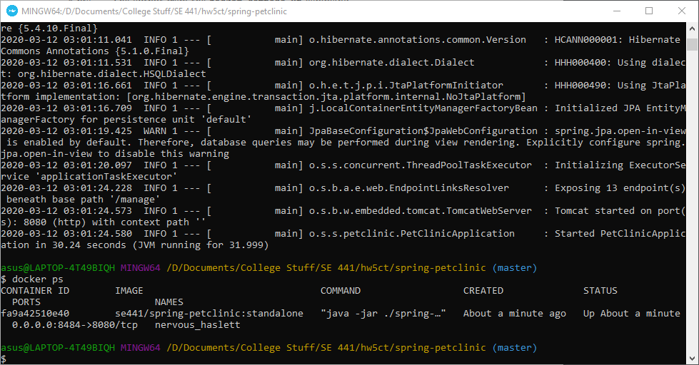

#### Main Page from Container
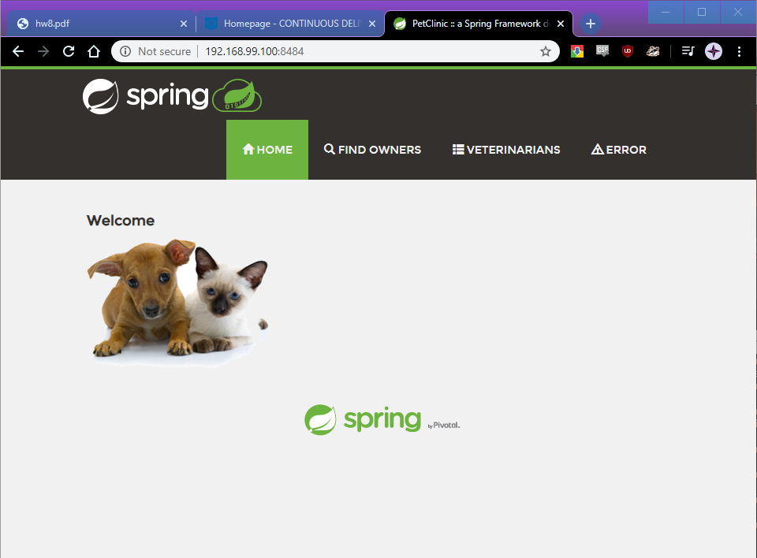

### Homework 5

#### Forked Repo Image 
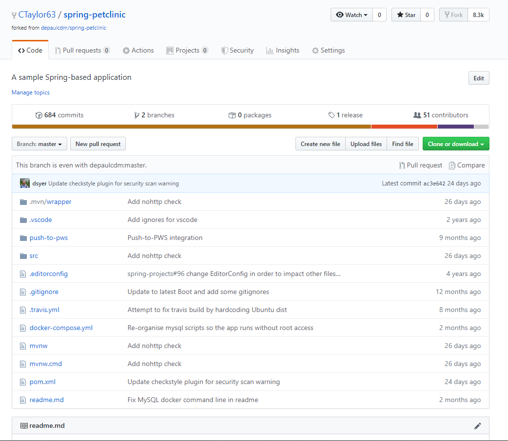

#### Successful First Build
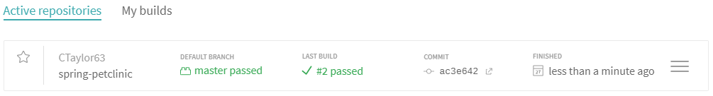

#### Changed POM Coords
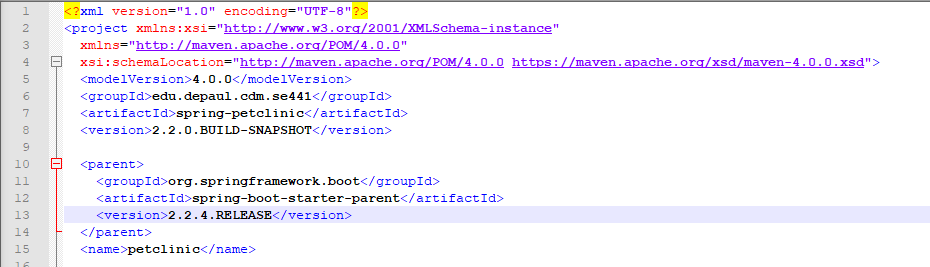

#### Sucessful Travis Build 
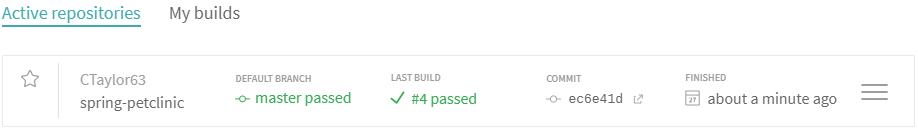

#### Commented out Coords 
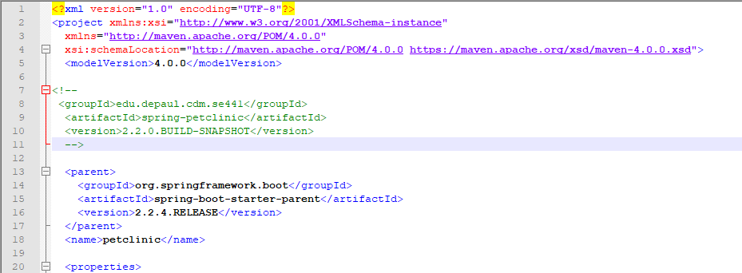

#### Failed Travis Build 
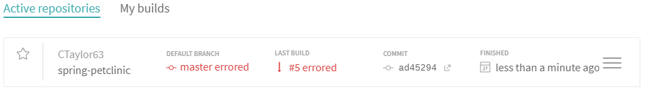

#### README Failure 
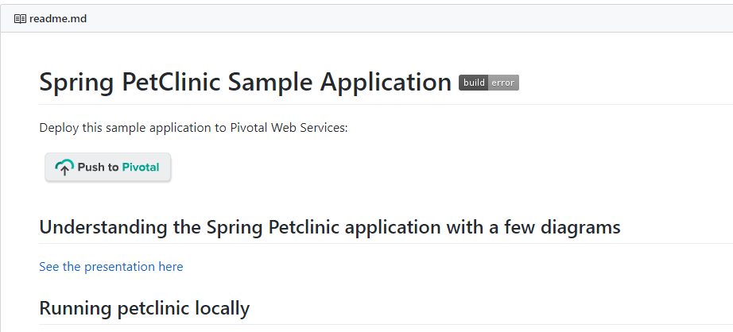

#### Fixed Coords 
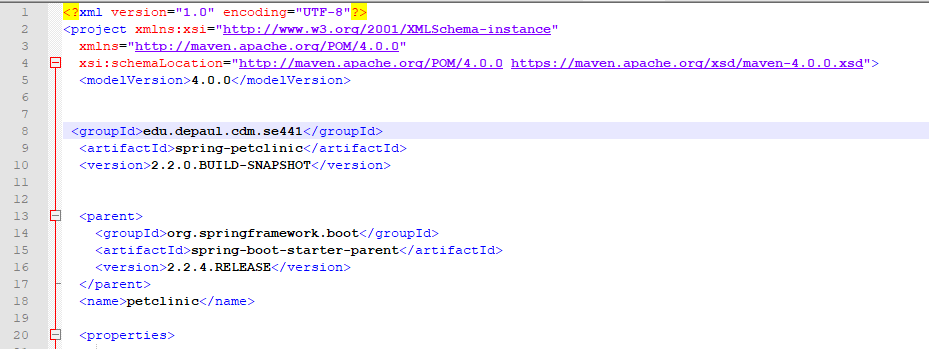

#### Travis After Fix 
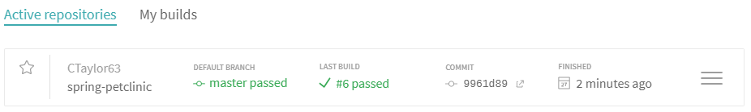

#### README After Fix 
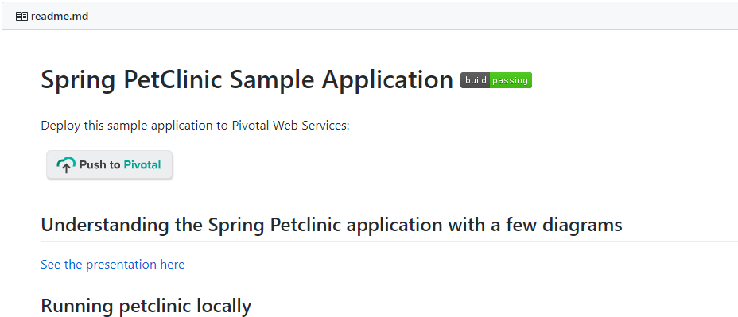
